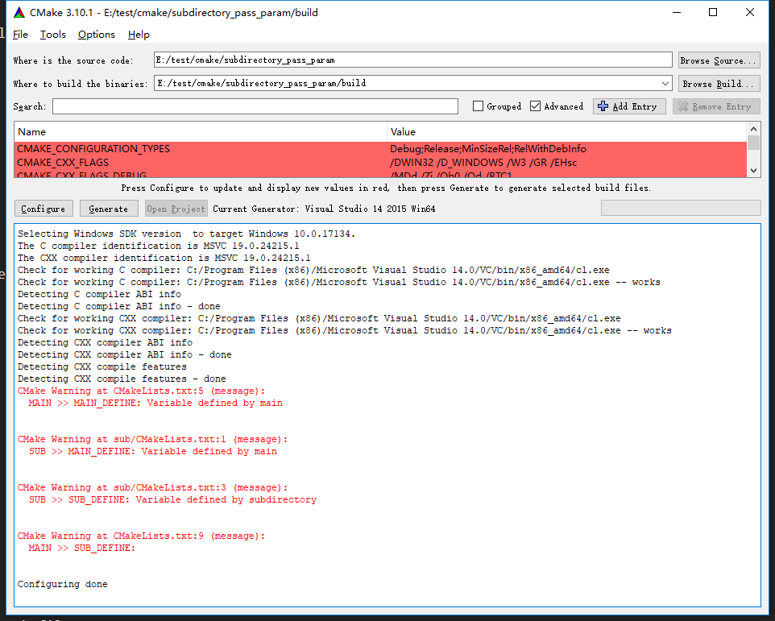

## 目的
测试变量在不同级别定义，然后在各个级别中引用的情况。

## 工程结构
-- root 
    -- sub 

## 测试方法
1. 在root中定义 **MAIN_DEFINE**, 在sub中打印该变量。
2. 在sub中定义 **SUB_DEFINE**, 在root中打印该变量。

## 结果
1. root中定义的变量sub可以正常使用。
2. sub中定义的变量root中无法使用。
3. 示例图：
